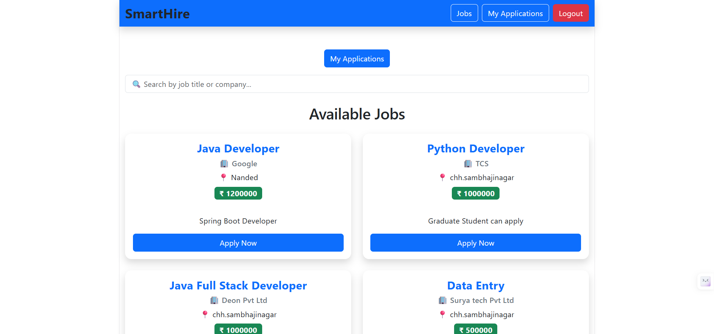
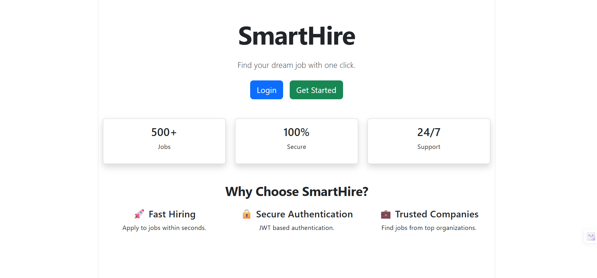
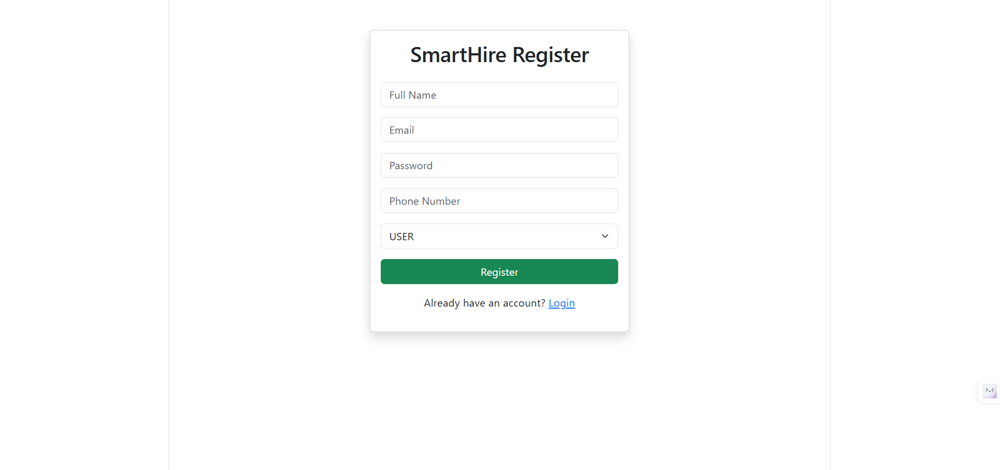
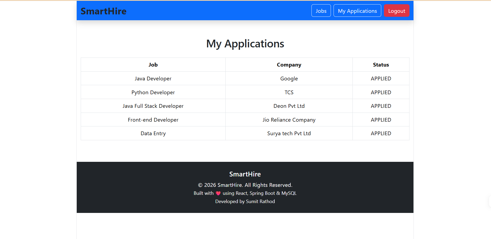
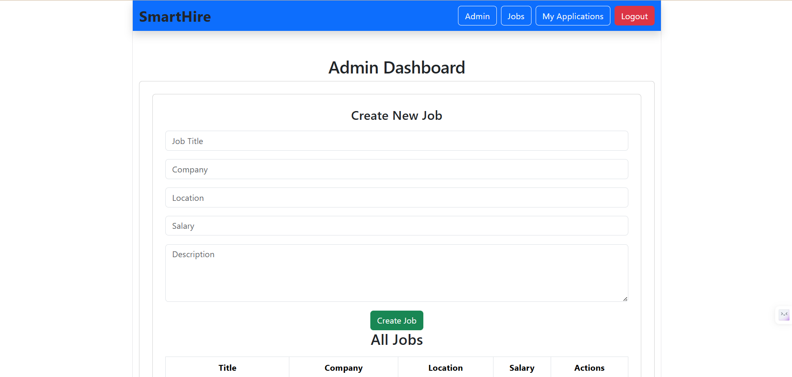

# 🚀 SmartHire - Full Stack Job Portal

> A modern Full Stack Job Portal built using **Spring Boot, React, JWT Authentication, Spring Security, and MySQL**. SmartHire enables users to register, browse jobs, apply for positions, and allows administrators to manage job postings through a secure role-based system.

---

## 📖 About

SmartHire is a full-stack web application developed to simplify the recruitment process for both job seekers and administrators.

The project demonstrates real-world full-stack development practices, including secure authentication, RESTful API development, role-based authorization, database management, and responsive frontend development.

---

## ✨ Features

### 👤 User Features
- User Registration
- Secure Login using JWT Authentication
- Browse Available Jobs
- Apply for Jobs
- View My Applications
- Responsive User Interface
- Protected Routes

### 👨‍💼 Admin Features
- Secure Admin Login
- Create New Jobs
- Update Existing Jobs
- Delete Jobs
- View All Available Jobs
- Role-Based Authorization

### 🔐 Security
- Spring Security
- JWT Authentication
- Password Encryption using BCrypt
- Protected REST APIs
- Role-Based Access Control

---

## 🛠 Tech Stack

### Frontend
- React.js
- React Router DOM
- Axios
- Bootstrap 5
- SweetAlert2

### Backend
- Java 21
- Spring Boot
- Spring Security
- Spring Data JPA
- Hibernate
- JWT

### Database
- MySQL

### Build Tool
- Maven

### Version Control
- Git
- GitHub

---

## 🏗 Architecture

```text
                React Frontend
                      │
                      │ Axios HTTP Requests
                      ▼
        Spring Boot REST API
                      │
          Spring Security + JWT
                      │
                      ▼
                Service Layer
                      │
                      ▼
              Spring Data JPA
                      │
                      ▼
                   MySQL
```

---

## 📂 Project Structure

### Backend

```
SmartHire-Backend
│
├── controller
├── service
├── repository
├── entity
├── dto
├── security
├── exception
├── config
└── resources
```

### Frontend

```
SmartHire-Frontend
│
├── components
├── pages
├── services
├── api
├── assets
└── App.jsx
```

---

## ⚙ Installation

### Clone Repository

```bash

git clone https://github.com/Sumit-code-04/SmartHire.git
```

### Backend

```bash
cd Backend
```


Run

```bash
mvn spring-boot:run
```

---

### Frontend

```bash
cd Frontend

npm install

npm run dev
```

---

## 🔗 API Endpoints

### Authentication

| Method | Endpoint |
|---------|----------|
| POST | /api/auth/register |
| POST | /api/auth/login |

---

### Jobs

| Method | Endpoint |
|---------|----------|
| GET | /api/jobs |
| POST | /api/admin/jobs |
| PUT | /api/admin/jobs/{id} |
| DELETE | /api/admin/jobs/{id} |

---

### Applications

| Method | Endpoint |
|---------|----------|
| POST | /api/applications/{jobId} |
| GET | /api/applications |

---

## 📸 Screenshots

### Home Page

```

```

---

### Login

```

```

---

### Register

```

```

---

---

### My Applications

```

```

---

### Admin Dashboard

```

```


---

## 🚀 Future Improvements

- Resume Upload
- Company Dashboard
- Email Notifications
- Search & Filters
- Pagination
- Profile Management
- Password Reset
- Docker Deployment
- CI/CD Pipeline
- Cloud Deployment
- Interview Scheduling
- AI Resume Matching
- Admin Analytics Dashboard

---

## 📚 What I Learned

During this project I gained hands-on experience with:

- Spring Boot
- Spring Security
- JWT Authentication
- REST API Development
- React.js
- React Router
- Axios
- MySQL
- JPA/Hibernate
- Role-Based Authentication
- Frontend-Backend Integration
- Git & GitHub

---

## 👨‍💻 Author

**Your Name**

B.Tech Computer Science Engineering

GitHub:
https://github.com/Sumit-code-04

LinkedIn:
https://www.linkedin.com/in/sumit-rathod-

## ⭐ Support

If you found this project useful, consider giving it a ⭐ on GitHub.